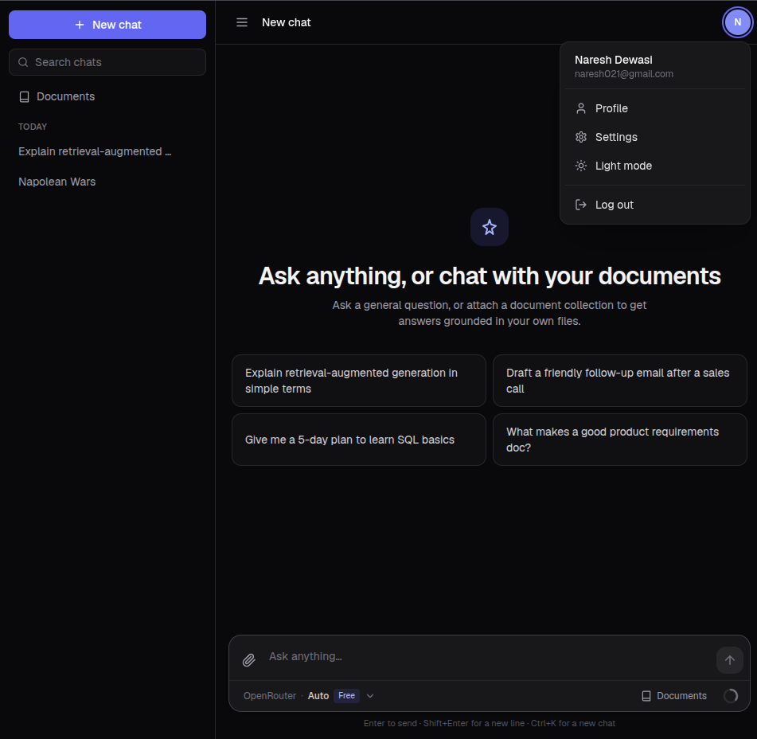
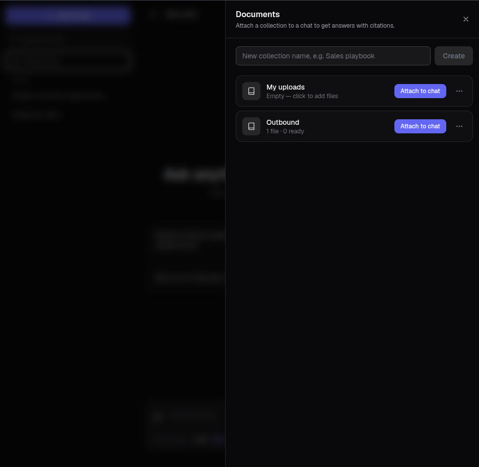
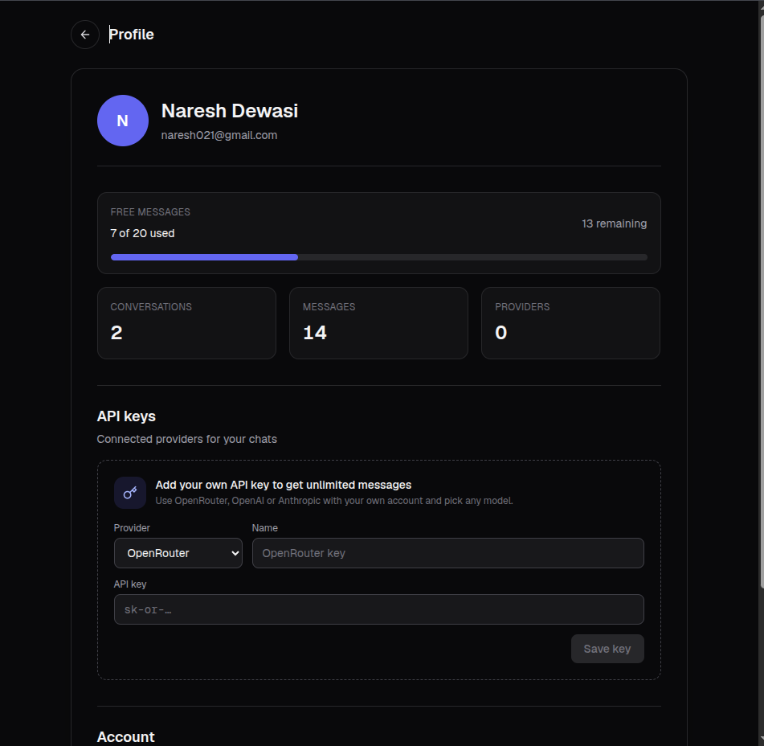

# RAG - Retrieval-Augmented Generation  

A self-hosted RAG chat application. Upload your documents, attach them to a conversation,
and the assistant answers **from those documents** — with inline citations you can click
to read the exact passage it used.

Built on Next.js 16, Postgres with `pgvector`, and hybrid retrieval. Everything runs on
your own infrastructure and your own API keys.

---

## Screenshots



<p align="center"><em>The home screen — suggested prompts, chat history, and the model picker in the composer.</em></p>



<p align="center"><em>The Documents drawer — create a collection, add files, and attach it to the current chat.</em></p>



<p align="center"><em>Profile — the free-message allowance, usage counts, and bring-your-own provider keys.</em></p>

---

## What makes it a RAG app

Most chat UIs paste your file into the prompt and hope. This one indexes it:

```
INGESTION (background, per document)
  upload / paste / URL
        │
        ├─ extract      PDF (per page) · DOCX · Markdown · HTML · plain text
        ├─ normalize    unicode, whitespace, running headers and footers
        ├─ dedupe       sha256 of the normalized text, per collection
        ├─ chunk        800 tokens, 100 overlap, split on headings first
        ├─ embed        batched, retried, 1536 dimensions
        └─ store        pgvector + a generated tsvector column
                            │
                     status: pending → processing → ready | failed

QUERY (per message, in front of the first token)
  your question
        │
        ├─ rewrite      "what about travel?" → a standalone query, using the last turns
        ├─ embed        as a question, not as a passage
        ├─ search       vector (HNSW cosine)  ──┐
        │               keyword (tsvector)    ──┤ in parallel
        ├─ fuse         reciprocal rank fusion ─┘
        ├─ filter       similarity floor, then a 3000-token context budget
        └─ prompt       numbered passages in the system message
                            │
              SSE: sources first, then the answer, then done
```

Answers cite `[1]`, `[2]` against those numbered passages, and every citation resolves to
a real chunk — document, heading, and page number for PDFs.

If nothing matches, the model is told to say so rather than improvise, and the UI shows a
grounding notice instead of silently answering from general knowledge.

---

## Features

**Documents**
- PDF, Word (`.docx`), Markdown, plain text and HTML
- Upload by drag-and-drop, paste text, or point it at a URL
- Collections of documents, attached per conversation and toggleable per message
- Live status per file: queued, processing, ready, or failed with a retry
- PDF chunks remember their page, so citations read `(p.12)`

**Retrieval**
- Hybrid search: pgvector cosine similarity + Postgres full-text, fused with RRF
- Heading-aware chunking with overlap, so a fact split across a boundary is still findable
- Follow-up questions rewritten into standalone queries before searching
- Embeddings through OpenRouter (default) or any OpenAI-compatible endpoint

**Chat**
- Streaming answers from OpenRouter, OpenAI or Anthropic, with a model picker
- Citations: hover an inline marker for a preview, click a chip for the passage in context
- Retrieval progress while the answer streams ("Searching… / Found 5 sources")
- Copy, feedback, regenerate and stop on every answer
- Conversation history with search and date grouping

**Account**
- Email/password auth with Argon2 hashing and database-backed sessions
- Per-user provider API keys; a free-message allowance using the server's key
- Change password (signs out other sessions) and delete account
- Light/dark theming, keyboard shortcuts, and animations that respect reduced motion

See [`features.md`](features.md) for the full list, and [`docs/rag-spec.md`](docs/rag-spec.md)
for the design and its known limitations.

---

## Quick start

### Prerequisites

- [Bun](https://bun.sh) — used for scripts and tests (`npm`/`node` also work for dev/build/start)
- PostgreSQL **with the `pgvector` extension available**. The migration runs
  `CREATE EXTENSION vector`, so the database role needs rights to do that.

### 1. Install

```bash
git clone https://github.com/nares10/rag-next
cd rag-next
bun install
```

### 2. Configure

Create `.env` in the project root:

```bash
# Database
DATABASE_URL=<postgres connection string>
TEST_DATABASE_URL=<a separate database; its name must contain "test">

# Embeddings — required for document search
EMBEDDING_PROVIDER=openrouter        # "openrouter" or "openai" (default: openrouter)
OPENROUTER_API_KEY=<key>             # also the chat fallback below

# Chat fallback for free messages (users add their own keys in the app)
AI_PROVIDER=openrouter
OPENROUTER_MODEL=<model id>

# Optional
OPENAI_API_KEY=<key>                 # embeddings with EMBEDDING_PROVIDER=openai only;
                                     # chat on OpenAI is bring-your-own-key and never
                                     # reads this
OPENAI_MODEL=<model id>
EMBEDDING_MODEL=<override the OpenRouter embedding model id>
OPENAI_EMBEDDING_MODEL=<override it on the EMBEDDING_PROVIDER=openai path>

# Endpoint overrides — a local gateway, or the test stub
OPENROUTER_BASE_URL=<default https://openrouter.ai/api/v1>   # chat, rewrite, embeddings
OPENAI_BASE_URL=<default https://api.openai.com/v1>
ANTHROPIC_BASE_URL=<default https://api.anthropic.com>

RAG_PROCESS_SECRET=<lets a queue or cron trigger document processing>
BASE_URL=<where the tests reach the app; default http://localhost:3000>
```

`.env*` is git-ignored — never commit real credentials.

### 3. Create the schema

```bash
bunx prisma generate
bunx prisma migrate deploy
bun run db:seed          # optional sample data; SEED_FORCE_RESET=true to wipe first
```

### 4. Run

```bash
bun run dev
```

Open <http://localhost:3000>, sign up, then open **Documents**, create a collection, add a
file, and attach it to the chat.

---

## Embeddings: the one decision that matters

Document search needs a **server-side embedding key**, whichever provider the chat itself
uses. A collection is only searchable if every vector in it — and the query vector — came
from the same model, so this is not something each user can choose.

| | `EMBEDDING_PROVIDER=openrouter` (default) | `EMBEDDING_PROVIDER=openai` |
|---|---|---|
| Model | `openai/text-embedding-3-small` | `text-embedding-3-small` |
| Cost | Paid per token | Paid per token |
| Key | `OPENROUTER_API_KEY` | `OPENAI_API_KEY` |
| Also covers | — | Any OpenAI-compatible endpoint via `OPENAI_BASE_URL` |

Both serve the same model at **1536 dimensions**, matching the `vector(1536)` column, so
vectors from either are interchangeable.

Two consequences worth knowing:

- **Changing the embedding model strands the existing corpus.** Vectors from different
  models are not comparable, so old chunks stop being searchable the moment the model
  changes. This is deliberate — retrieval filters them out rather than returning nonsense
  — but there is no re-embedding script yet, so re-add the documents after a switch.
- **Without an embedding key, chat still works.** Retrieval degrades and the UI says
  document search is unavailable, rather than failing the message.

---

## Document limits

| | |
|---|---|
| Upload size | 4 MB — the serverless request-body cap |
| URL fetch | 20 MB, enforced while the response streams |
| Per document | 2,000 chunks |
| Per user | 50 documents, 20,000 chunks |
| Paste | 1 MB of text |

URLs are checked before every fetch and on each redirect: non-HTTP schemes, internal
hostnames and anything resolving to a private address are refused, so "fetch this URL"
cannot be turned into a request against your own network.

---

## Testing

The suite is mostly integration tests over HTTP, so it needs two processes beside it. No
test ever calls a paid API.

```bash
# 1. the stub provider — deterministic embeddings and a canned streamed reply
bun run stub

# 2. the app, pointed at the test database and the stub
DATABASE_URL=$TEST_DATABASE_URL \
OPENROUTER_API_KEY=stub-key \
OPENROUTER_BASE_URL=http://localhost:4010/v1 \
bun run dev

# 3. the tests
bun test                              # everything
bun test tests/rag                    # the RAG pipeline
BASE_URL=http://localhost:3001 bun test   # if the app is on another port
```


`OPENAI_API_KEY` and `ANTHROPIC_API_KEY` can be left as they are — the chat route never
reads them. Those two providers are bring-your-own-key, which is the branch
`tests/chat.test.ts` asserts. The pure unit tests (chunking, normalization, fusion, prompt
assembly, extraction, embeddings, URL guarding) need neither process.

`TEST_DATABASE_URL` must name a database containing `test`; the harness refuses to clean
anything else. The suite truncates that database, so two runs cannot share it.

### Retrieval eval

Retrieval quality is measured, not guessed. [`tests/eval/`](tests/eval/README.md) holds two
corpora and 42 questions — 36 with a known answer, 6 that nothing should match.

```bash
DATABASE_URL=$TEST_DATABASE_URL bun run eval                    # fake embedder, vs baseline
DATABASE_URL=$TEST_DATABASE_URL bun run eval --embedder=openrouter  # real model
DATABASE_URL=$TEST_DATABASE_URL bun run eval --record           # update the baseline
```

Scored on recall@1/3/6, MRR, heading accuracy and abstention. Run it before and after
changing anything under `lib/rag/` — a drop below the recorded baseline exits non-zero.

---

## Project layout

```
app/
  api/rag/          collections, documents, chunks, search
  api/chat/         the streaming chat endpoint, where retrieval is injected
components/         chat UI, documents drawer, citation panel
hooks/              data loading and the chat stream reader
lib/rag/
  extract.ts        PDF, DOCX, HTML and text → markdown
  normalize.ts      unicode, whitespace, running headers
  chunk.ts          heading-aware splitting with overlap
  embed.ts          OpenRouter and OpenAI providers, batching and retries
  ingest.ts         the write pipeline, end to end
  retrieve.ts       hybrid search over pgvector + tsvector
  fuse.ts           reciprocal rank fusion
  rewrite.ts        follow-up → standalone query
  prompt.ts         numbered context and citations
  chat-context.ts   retrieval orchestration for the chat route
  url-guard.ts      SSRF protection for URL sources
prisma/             schema and migrations (including the pgvector migration)
scripts/            seed, stub provider, eval runner, fixture generator
tests/              unit, integration and eval suites
docs/rag-spec.md    design, decisions, and what is deliberately missing
```

---

## Scripts

| Script | Description |
| --- | --- |
| `bun run dev` | Start the dev server |
| `bun run build` | Production build (generates the client and applies migrations) |
| `bun run start` | Start the production server |
| `bun run lint` | ESLint |
| `bun run db:seed` | Seed sample data |
| `bun run stub` | Stub AI provider for the tests (port 4010) |
| `bun run eval` | Score retrieval against the eval set |
| `bun test` | Run the test suite |
| `bun run test:watch` | Tests in watch mode |
| `bun run db:test:deploy` | Migrate the test database (needs a `.env.test` file) |
| `bun run test:db` | Migrate the test database, then test (needs `.env.test`) |

---

## Known limitations

- Uploads are capped at 4 MB until direct-to-storage upload lands; URLs stream to 20 MB.
- Uploaded bytes are not kept, so a failed file is re-uploaded rather than retried.
- No re-embedding script, so changing the embedding model means re-adding documents.
- The similarity floor is a single global constant and is currently too permissive for
  real embedding models — the eval set measures this; see `docs/rag-spec.md`.

